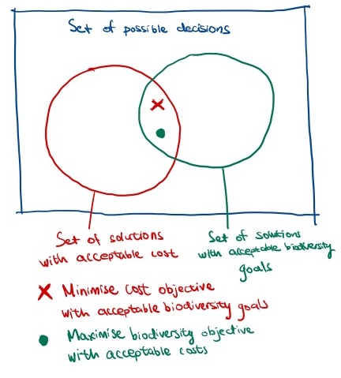
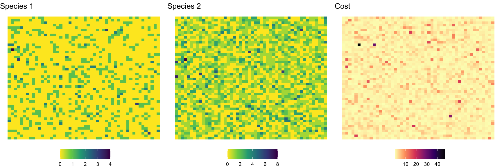
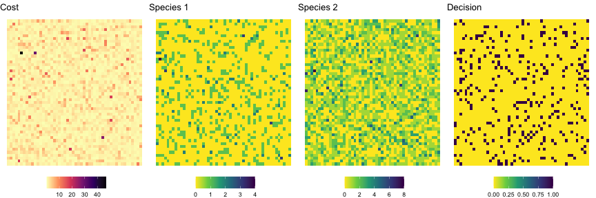
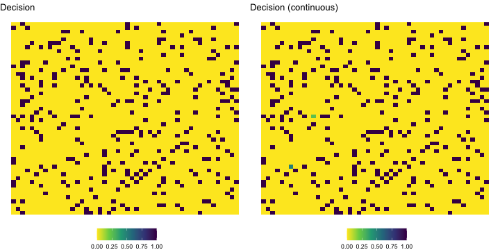
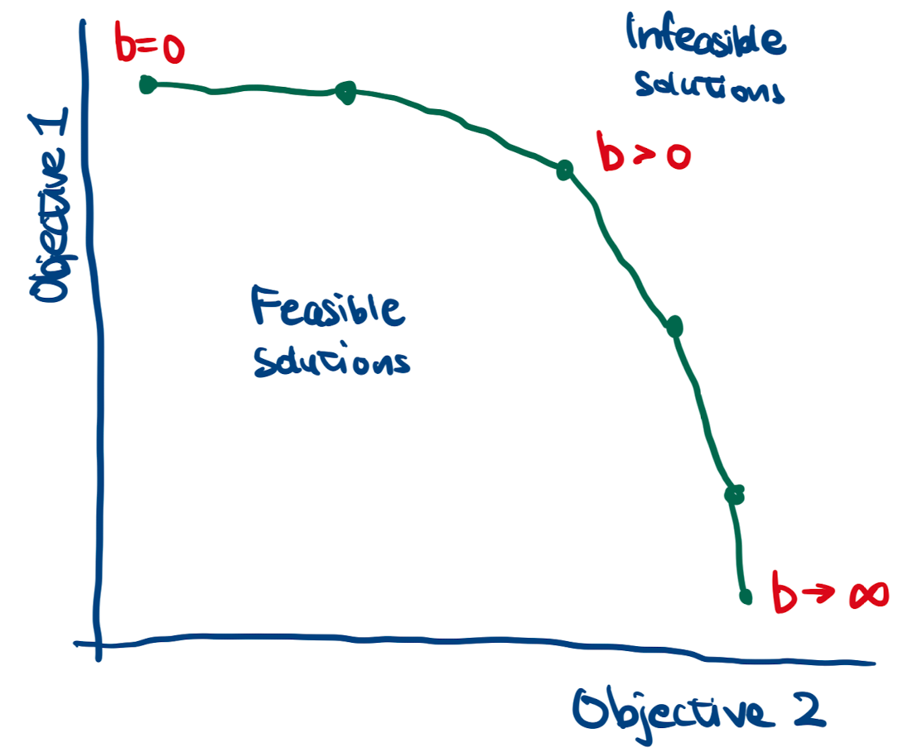
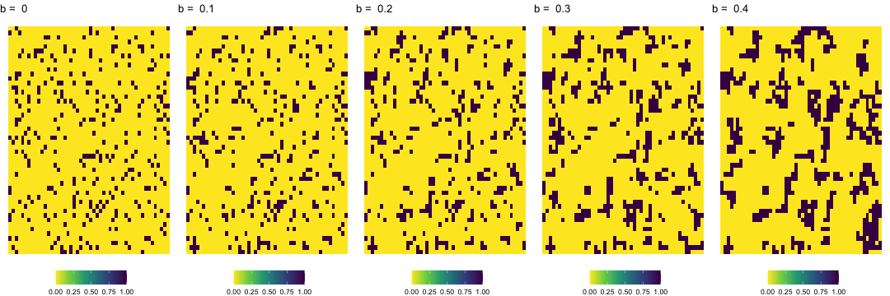
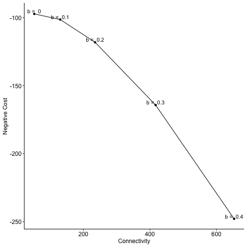

<style>
.small-code pre code {
  font-size: .8em;
}
body {
    overflow: scroll;
}
</style>

Integer Linear Programming for Spatial Conservation Planning
========================================================
author: Frankie Cho
date: 15 August 2022
autosize: true
UQ CBCS

What this skills training will be about
========================================================
- What are ILPs?
- Reading the math formulae of an ILP
- Setting up and solving the ILP in Gurobi
- Integer constraints
- Facilitating connectivity

What are Linear Programs?
========================================================
Asking a computer to make decisions!
- Problem: many many possible options (combination of actions across space)
- Objective: how "good" a decision is
- Constraints: defines the set of possible decisions -- what you can and can't do

Applications of LP/ ILP
========================================================
- Conservation decision making
- Transportation/ facility location problems
- Network flow and optimization
- Scheduling
- Design markets (e.g. auctions, fixed-price payments)

Why do we need Linear Programs?
========================================================
class: small-code
Consider a decision problem of choosing 25% of locations out of $N$ locations for conservation.

Each location is either "chosen" or "not chosen" (0 or 1).


```r
source('ilp-intro-functions.R')
N <- c(20,80,100,1000)
nchoosek <- function(n) choose(n, n/4)
Combinations <- sapply(N, nchoosek)
knitr::kable(data.frame(N, Combinations))
```


|    N|  Combinations|
|----:|-------------:|
|   20|  1.550400e+04|
|   80|  3.535316e+18|
|  100|  2.425193e+23|
| 1000| 4.822840e+242|

How to search through these combinations efficiently?

Why Linear Programming?
========================================================
Compared to simulated annealing based methods ILP offers:
- Known solution quality (known gap to optimality)
- (Generally) shorter computation time
- Cross-disciplinary: immediately benefit from latest models/ software in operations research & maths instead of waiting for it to "trickle-down" to your domain

What data do we need?
========================================================
a) Data for the objective function

b) Data for the constraints

c) List of variables we "allow" the computer to choose


### Example: Planning for reserve sites

a) Raster of the costs of reserve sites

b) Raster of species distribution, spatial connectivity matrix

c) Binary decision variable: whether a reserve site is "selected" in the location

Possible ILP formulations
========================================================
1. Minimise cost while constraining biodiversity goals
2. Maximise biodiversity goals while keeping a budget

***


Code example: cost minimization problem
========================================================

- Objective: Minimize total cost of conservation
- Constraint: Protect 25% of the population present in this habitat (goal)

Code example: cost minimization problem
========================================================
class: small-code

```r
set.seed(123)
nx <- 50
ny <- 50
N  <- nx*ny
r1 <- matrix(rpois(nx*ny, correlatedSpatialGrid(.5,nx,ny)), ncol = ny, nrow = nx)
r2 <- matrix(rpois(nx*ny, correlatedSpatialGrid(2,nx,ny)), ncol = ny, nrow = nx)
c  <- matrix(exp(rnorm(correlatedSpatialGrid(5,nx,ny), 0)), ncol = ny, nrow = nx)
plotR1 <- plotSpatialGrid(r1, label = "Species 1", colorScheme = 'viridis')
plotR2 <- plotSpatialGrid(r2, label = "Species 2", colorScheme = 'viridis')
plotC  <- plotSpatialGrid(c, label = "Cost", colorScheme = 'magma')
ggpubr::ggarrange(plotR1, plotR2, plotC, nrow = 1)
```



Reserve Selection Problem
========================================================
left: 70%

$$ \min_\mathbf{x} \sum^N_{i=1} c_i x_i \: (1) $$
$$ s.t. \sum_{i=1}^N r_{ik} x_i \geq T_k, \forall k \in K \: (2) $$
$$ x_i \in \{0,1\} \: (3) $$

How to use these formulations in my own problem??

We need to find **data** variables and **decision** variables

***

1. Objective function
2. Linear constraints
3. Bound constraints

Components of the problem
========================================================
title: false
### Our problem
$N= 2500$: 2500` possible locations to choose from

$K=2$: two species we are concerned about

### Data we give to the problem
$\mathbf{c} = [c_1, c_2, ..., c_N]$ : vector of length N, costs of setting up a reserve at each location

$\mathbf{r}_k = [r_{1k}, r_{2k}, ..., r_{Nk}]$ : vector of length N, number of the species $k$ in each location -- we have $K$ number of these vectors

$T_k$: a scalar, conservation objective for each species


### Gurobi figures out (decision variable)
$\mathbf{x} = [x_1, x_2, ..., x_N]$ : vector of length N

Gurobi find the vector $\mathbf{x}$ that optimises the objective function

How to tell between decision variables and data variables?
========================================================
In an LP/ ILP/ MILP, a decision variable cannot be multiplied with another decision variable

e.g. $x_ix_j$ is not feasible in the LP -- if two decision variables are multiplied together, then the problem will be a quadratic program (QP) -- computationally intensive

Beyer et al. (2016) overcomes this problem with 'linearization' -- using another integer variable to represent binary variables multiplied together

Data variables can multiply with other data variables. Multiplication occurs before the problem is solved.

Set notation for decision variables
========================================================
Decision variables need to lie in a **set**. This describes the range of values these decision variables can take.
### Real numbers
$x_i \in \mathbb{R}$: $x_i$ can be any real number

### Intervals
$x_i \in [0,1]$ : $x_i$ is **between** 0 and 1; can be non-integer;
same as: $0 \leq x_i \leq 1$

### Integers
$x_i \in \{0,1\}$ : $x_i$ is **either** 0 or 1 (i.e. integer)

$x_i \in \mathbb{Z}$: $x_i$ must be an integer

$x_i \in \mathbb{Z}^+$: $x_i$ must be a positive integer

Why bother with matrix notation??
========================================================
Gurobi accepts problems in the following form:

$$
\min_\mathbf{x} \mathbf{c'x} \\
s.t. \mathbf{A'x} \leq \mathbf{b}
$$

Linear algebra
========================================================
Vector-by-vector multiplication $\mathbf{c'x}$

$$
\begin{bmatrix}
c_1 & c_2
\end{bmatrix}
\begin{bmatrix}
x_1 \\
x_2
\end{bmatrix}
=
c_1x_1 + c_2x_2
$$

Matrix-by-vector multiplication $\mathbf{A'x}\leq b$

$$
\begin{bmatrix}
r_{1,1} & r_{2,1} \\
r_{1,2} & r_{2,2}
\end{bmatrix}
\begin{bmatrix}
x_1 \\
x_2
\end{bmatrix}
=
\begin{bmatrix}
r_{1,1}x_1 + r_{2,1}x_1 \\
r_{1,2}x_2 + r_{2,2}x_2
\end{bmatrix}
< 
\begin{bmatrix}
T_1 \\
T_2
\end{bmatrix}
$$

From matrices to Gurobi
========================================================
class: small-code
title: false

`result <- gurobi(model, params)`

## Input

`model$obj` : $\mathbf{c}$ 

`model$A` : $\mathbf{A}$

`model$rhs` : $\mathbf{b}$

`model$modelsense` : $\min$

`model$sense` : $<$

## Output

`result$x` : $\mathbf{x}$

`result$objval` : $\mathbf{c'x}$

Equivalent formulations side-by-side
========================================================
title: false
$$ \min_\mathbf{x} \sum^N_{i=1} c_i x_i \: (1) $$
$$ s.t. \sum_{i=1}^N r_{ik} x_i \geq T_k, \forall k \in K \: (2) $$
$$ x_i \in \{0,1\} \: (3) $$

Equivalent matrix formulation:
$$ \min_\mathbf{x} \mathbf{c'x}\: (1) $$
$$ s.t. \mathbf{r}_k' \mathbf{x} \geq T_k, \forall k \in K \: (2) $$
$$ \mathbf{x} \in \{0,1\} \: (3) $$

Solve the problem
========================================================
class: small-code

```r
model <- list()
model$obj <- as.vector(c)
model$modelsense <- 'min'
model$A   <- matrix(c(as.vector(r1), as.vector(r2)), nrow = 2, byrow = T)
model$rhs <- c(0.25*sum(r1),0.25*sum(r2))
model$sense <- '>='
model$vtype <- 'B'
# result <- gurobi(model, list())
result <- rsymphony_solve_gurobi(model, list())

plotX <- plotSpatialGrid(matrix(result$x, ncol = ny, nrow = nx), 'Decision', 'viridis')
ggarrange(plotC, plotR1, plotR2, plotX, nrow = 1)
```



Improving the model?
========================================================
1. Improving performance by removing integer constraints?
2. Spatial connectivity?

Integer LP? Mixed-Integer LP?
========================================================
- LP allows for non-integer decision variable
- ILP: all decision variables are constrained to be integers (NP-hard)
- MILP: some decision variables continuous, others constrained to be integers
- Mixed-Integer LP most common in LP
- Why does your problem need integer constraints?
- Effect on performance

Improving performance: are integer constraints necessary for your problem?
========================================================
class: small-code

LP solves much quicker than ILP/ MILP because it takes advantages of more efficient algorithms. 


```r
start_time_integer <- Sys.time()
integer_result <- rsymphony_solve_gurobi(model, list())
end_time_integer <- Sys.time()

model_cont <- model
model_cont$vtype <- 'C'
model_cont$lb    <- rep(0,nx*ny)
model_cont$ub    <- rep(1,nx*ny)
start_time_cont <- Sys.time()
non_integer_result <- rsymphony_solve_gurobi(model_cont, list())
end_time_cont <- Sys.time()

integer_time <- end_time_integer - start_time_integer
cont_time    <- end_time_cont    - start_time_cont
```

```r
integer_time
```

```
Time difference of 5.439219 secs
```

```r
cont_time
```

```
Time difference of 0.01956892 secs
```

Integer relaxation -- results
========================================================
title: false
class: small-code

Some LP will lead to integer results even when integer constraints are not explicitly imposed. Investigate why integer constraints are needed for your problem.

```r
plotXInt <- plotSpatialGrid(matrix(integer_result$x, ncol = ny, nrow = nx), 'Decision (integer)', 'viridis')
plotXCont <- plotSpatialGrid(matrix(non_integer_result$x, ncol = ny, nrow = nx), 'Decision (continuous)', 'viridis')
ggarrange(plotX, plotXCont, nrow=1);
```



Spatial connectivity
========================================================
- Even though species distribution and costs are spatially correlated, the sites selected weren't
- Minimum viable habitat for species? Minimum area needed for management actions?
- Penalties for spatial fragmentation?


Rewarding spatially-connected solutions in the objective
========================================================
$$
\min_{\mathbf{x}} \sum_{i=1}^N c_ix_i - b \sum_{i=1}^N \sum_{j=1}^N z_{ij} \\
s.t. - x_i + z_{ij} \leq 0  \: \forall (i,j) \in E \\
- x_j + z_{ij} \leq 0  \:  \forall (i,j) \in E \\
- x_i - x_j + z_{ij} \geq -1  \:  \forall (i,j) \in E
$$

This ensured that for neighbours $i$ and $j$, if both $x_i$ and $x_j$ are equal to $1$, then $z_{ij}$ must be 1. Otherwise, $z_{ij} = 0$. In other words $z_{ij}$ replaced $x_ix_j$.

Notice the increase in number of constraints! (increase by number of elements in $E$ times 3)

Weighting factor
========================================================
- $b$: controls relative weighting between multiple objectives
- If $b$ is small, then the first objective (minimising cost) is more important
- If $b$ is large, then the second objective (spatial connectivity) is more important
- Researcher solves problems by iterating values of $b$
- Set of solutions where you cannot improve one objective without doing worse in another objective

***

"Efficiency frontier" 
aka: "Pareto frontier", "Trade-off curves"


Set up a constraint matrix
========================================================
class: small-code
Possible to alter the spatial connectivity in result through a linearised objective


```r
W <- spatialWeightsMatrix(nx, ny, rowStandardise = FALSE)
W[lower.tri(W)] <- 0 # Set it as a upper triangular matrix
E <- which(W!=0, arr.ind = TRUE) # Get set of neighbours E, with two columns, one for index of i and one for index of j
num_neighbours <- nrow(E)
A_r1 <- c(as.vector(r1), rep(0, num_neighbours))
A_r2 <- c(as.vector(r2), rep(0, num_neighbours))
A_E <- matrix(0, nrow = num_neighbours*3, ncol = length(r1)+num_neighbours)
bVector <- c(0.25*sum(r1),0.25*sum(r2))
senseVector <- c('>=','>=')
# Loop through all the elements in the set of neighbours
for (s in 1:nrow(E)) {
  # Given three constraints:
  # z_ij - x_i < 0, coefficients for z_ij and x_i are 1 and -1
  # z_ij - x_j < 0, coefficients for z_ij and x_j are 1 and -1
  # z_ij - x_i - x_j < -1, coefficients for z_ij, x_i and x_j are 1, -1 and -1 respectively
  row <- ((1+(s-1)*3)):(((s-1)*3)+3)
  A_E[row,E[s,1]] <- c(-1, 0, -1) # Coefficients for x_i
  A_E[row,E[s,2]] <- c( 0,-1, -1) # Coefficients for x_j
  A_E[row,s+(nx*ny)]         <- c(1, 1, 1) # Coefficients for z_ij are all 1
  senseVector <- c(senseVector, '<=', '<=', '>=') # Inequality constraints
  bVector <- c(bVector, 0,0,-1) # RHS of the equation
}

model_connectivity <- list()
model_connectivity$modelsense <- 'min'
model_connectivity$A   <- rbind(A_r1, A_r2, A_E)
model_connectivity$rhs <- bVector
model_connectivity$sense <- senseVector
model_connectivity$vtype <- 'B'

b <- seq(0,0.5,0.1)
result_connectivity <- list()
## Loop through all 5 selections of b
for (i in 1:length(b)) {
  model_connectivity$obj <- c(as.vector(c), rep(-b[i], num_neighbours))
  result_connectivity[[i]] <- rsymphony_solve_gurobi(model_connectivity, list())  
}
```
Results
========================================================
class: small-code

```r
plot_connectivity = list()
for (i in 1:length(b)) {
  plot_connectivity[[i]] <- plotSpatialGrid(matrix(
    result_connectivity[[i]]$x[1:(nx*ny)], ncol = ny, nrow = nx), 
    paste("b = ", as.character(b[i])))
}

ggarrange(plotlist = plot_connectivity, nrow = 1)
```



Efficiency frontier
========================================================
class: small-code

```r
efficiencyFrontier <- data.frame(b = b, cost = rep(0,length(b)), connectivity = rep(0,length(b)))

for (i in 1:length(b)) {
  x <- result_connectivity[[i]]$x[1:(nx*ny)]
  z_ij <- result_connectivity[[i]]$x[(nx*ny+1):length(result_connectivity[[i]]$x)]
  efficiencyFrontier[i,2] <- as.vector(c)%*%x
  efficiencyFrontier[i,3] <- sum(z_ij)
}
ggplot(efficiencyFrontier,aes(y = -cost, x = connectivity, label = paste('b = ',b))) +
  geom_smooth(method = 'glm', se=F, formula = y ~ poly(x,3)) +
  geom_point() +
  geom_text(vjust = 0, nudge_y = 1) +
  scale_y_continuous('Cost (negative)')+
  scale_x_continuous('Connectivity')+
  theme_bw()
```



That's a wrap!
========================================================
- Hopefully you will have picked up some idea about how an ILP works!
- Share any thoughts or experiences you have on this topic!

Appendix 1 - Alternative formulation: a goal maximization problem
========================================================
$$
\min_\mathbf{x} \sum_{i=1}^N \sum_{k\in K} r_{ik}x_i \\
s.t. \sum_{i=1}^N c_i x_i \leq B \\
x_i \in \{0,1\}
$$


Setting a minimum area target
========================================================
Ensures that if $x_a$ is selected, $n$ number of its neighbours are also selected
$$
\min_{\mathbf{x}} \sum_{i=1}^N c_ix_i \\
s.t. \sum^{m}_{i=1}x_i \geq nx_a
$$

Appendix 2. Setting up the problem with a spatial neighbour matrix
========================================================

```r
W <- spatialWeightsMatrix(nx, ny, rowStandardise = FALSE)
constraintMatrixNeighbour <- function(W, n) {
  A <- matrix(0, nrow = nrow(W), ncol = nrow(W))
  for (i in 1:nrow(W)) {
    # Initialise vector of zeros corresponding to the length of the decision vector (for that row of constraint)
    aj <- W[,i]
    # Set the number of neighbours for i
    aj[i] <- -n
    # Set the matrix back to A
    A[,i] <- aj
  }
  A
}

model_neighbour <- model
model_neighbour$modelsense <- 'min'
model_neighbour$sense <- ">="
model_neighbour$vtype <- 'B'

neighbours <- c(0,1,2,3)
result_neighbour <- list()
## Loop through all 5 selections of b
for (i in 1:length(neighbours)) {
  model_neighbour$A <- rbind(model$A, constraintMatrixNeighbour(W, neighbours[i]))
  model_neighbour$rhs <- c(model$rhs, rep(0, nx*ny))
  result_neighbour[[i]] <- rsymphony_solve_gurobi(model_neighbour, list())  
}
```

Results
========================================================
class: small-code

```r
plot_neighbour = list()
for (i in 1:length(neighbours)) {
  plot_neighbour[[i]] <- plotSpatialGrid(matrix(
    result_neighbour[[i]]$x[1:(nx*ny)], ncol = ny, nrow = nx), 
    paste("n = ", as.character(neighbours[i])))
}

ggarrange(plotlist = plot_neighbour, nrow = 1)
```


